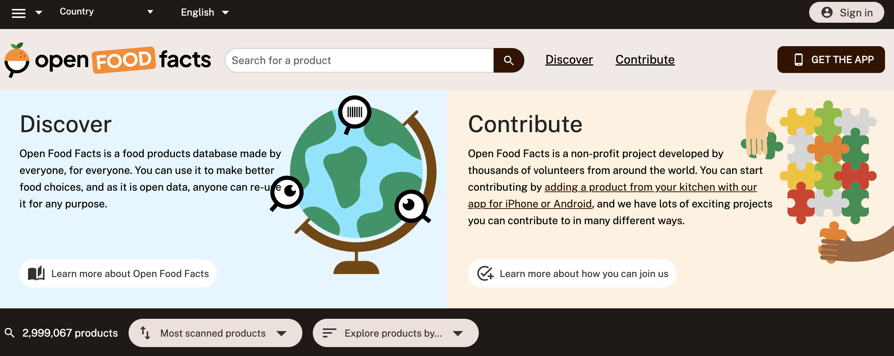
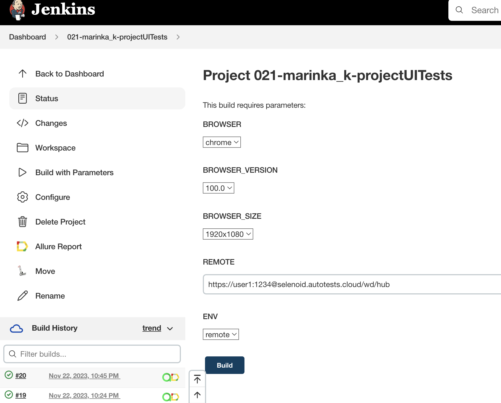
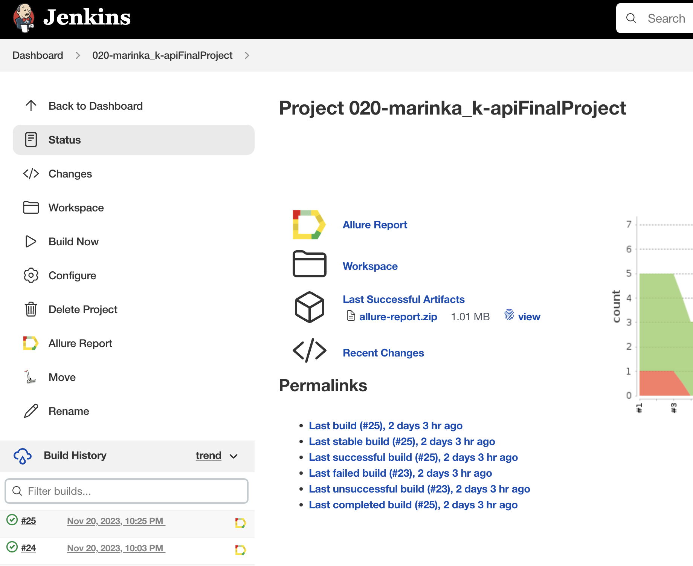
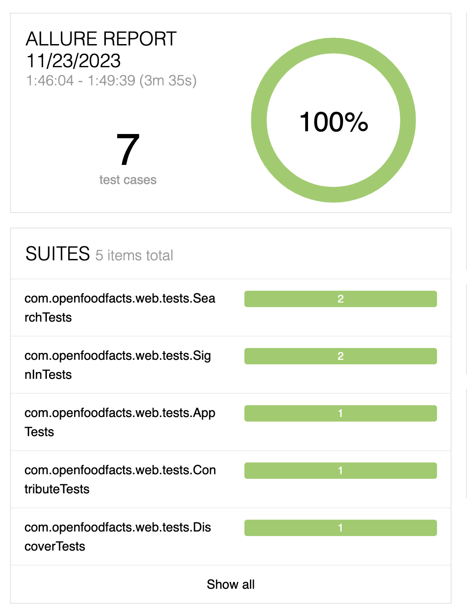
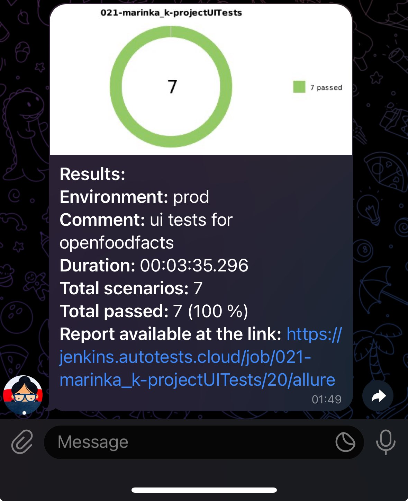
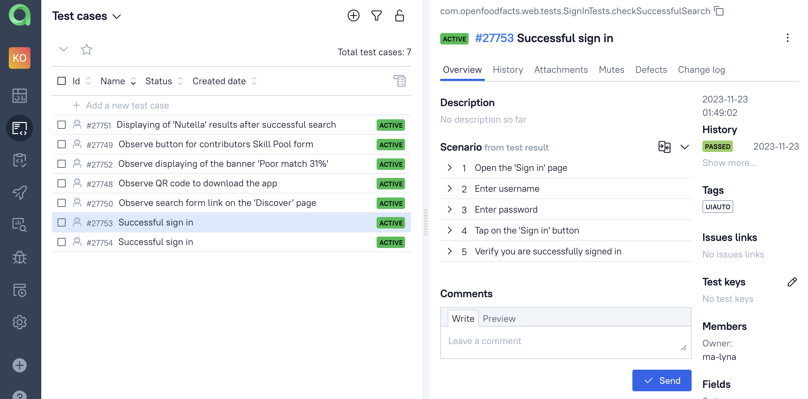

# UI и API autotests for [openfoodfacts](https://world.openfoodfacts.org/)



## <a id="list"></a> Content 

* <a href="#tools">Тools and technologies</a>

* <a href="#cases">Tests</a>:   
  - <a href="#cases-ui"> UI
  - <a href="#cases-api"> API

* <a href="#integrations">Integrations</a>

* <a href="#console">Launch via terminal</a>
  - <a href="#console-ui"> UI
  - <a href="#console-api"> API

* <a href="#jenkins">Jenkins jobs</a>

* <a href="#allure">Allure reports</a>

* <a href="#telegram">Telegram reports</a>

* <a href="#testops">Integration with Allure TestOps</a>


## <a id="tools"></a> Tools and technologies
<p align="center">
<a href="https://www.jetbrains.com/idea/"></a>
<a href="https://www.java.com/"></a>
<a href="https://github.com/"></a>
<a href="https://junit.org/junit5/"></a>
<a href="https://gradle.org/"></a>
<a href="https://selenide.org/"></a>
<a href="https://aerokube.com/selenoid/"></a>
<a href="https://github.com/allure-framework/allure2"></a>
<a href="https://qameta.io"></a>
<a href="https://www.jenkins.io/"></a>
<a href="https://telegram.org/"></a>
</p>


## <a id="cases"></a> Tests
<a id="cases-ui"></a>UI cases:

:heavy_check_mark: Successful sign in

:heavy_check_mark: Unsuccessful sign in

:heavy_check_mark: Observe QR code to download the app  

:heavy_check_mark: Observe button for contributors Skill Pool form  

:heavy_check_mark: Observe search form link on the 'Discover' page 

:heavy_check_mark: Displaying of 'Nutella' results after successful search 

:heavy_check_mark: Observe displaying of the banner 'Poor match 31%'  
  
<a id="cases-api"></a>API cases:
  
:heavy_check_mark: Get information about sugars for the particular product 

:heavy_check_mark: Information about allergens is not shown in case of invalid product id

:heavy_check_mark: Get product name for a particular product id

:heavy_check_mark: Information about product is not shown in case of invalid product id 

:heavy_check_mark: A new product is successfully added 

:heavy_check_mark: A new product is not added  

:heavy_check_mark: Photo is successfully cropped  

<a href="#list">Content</a>

## 	<a id="integrations"></a> Integrations
:heavy_check_mark: Launch tests in Jenkins  

:heavy_check_mark: Allure Report + SelenideLogger.addListener + step()   

:heavy_check_mark: Notifications in Telegram 

:heavy_check_mark: Allure TestOps    

:heavy_check_mark: Selenoid   

:heavy_check_mark: Owner   

<a href="#list">Content</a>

## <a id="console"></a> Launch via terminal
  
### <a id="console-ui"></a>Launch UI tests locally

```
gradle clean uiAuto_test
```

### <a id="console-api"></a>Launch API tests locally

```
gradle clean apiAuto_test
```
  
### Launch tests via Jenkins

```
clean
-Dbrowser=${BROWSER}
-DbrowserVersion=${BROWSER_VERSION}
-DbrowserSize=${BROWSER_SIZE}
-Dremote=${REMOTE}
-Denv=${ENV}
uiAuto_test
```

```
clean apiAuto_test "-Dname=${NAME}"
```


<a href="#list">Content</a>

## <a id="jenkins"></a> Job for UI tests in [Jenkins](https://jenkins.autotests.cloud/job/021-marinka_k-projectUITests/)



## <a id="jenkins"></a> Job for API tests in [Jenkins](https://jenkins.autotests.cloud/job/020-marinka_k-apiFinalProject/)



<a href="#list">Content</a>

:information_source: Allure Reports



## <a id="allure"></a> [Allure](https://jenkins.autotests.cloud/job/021-marinka_k-projectUITests/20/allure/) UI reports


## <a id="allure"></a> [Allure](https://jenkins.autotests.cloud/job/020-marinka_k-apiFinalProject/25/allure/) API reports


<a href="#list">Content</a>

## <a id="telegram"></a>Telegram reports

:information_source: Тelegram notifications



<a href="#list">Content</a>

## <a id="testops"> Integration with [Allure TestOps](https://allure.autotests.cloud/project/3840/test-cases/27753?treeId=0)
  

